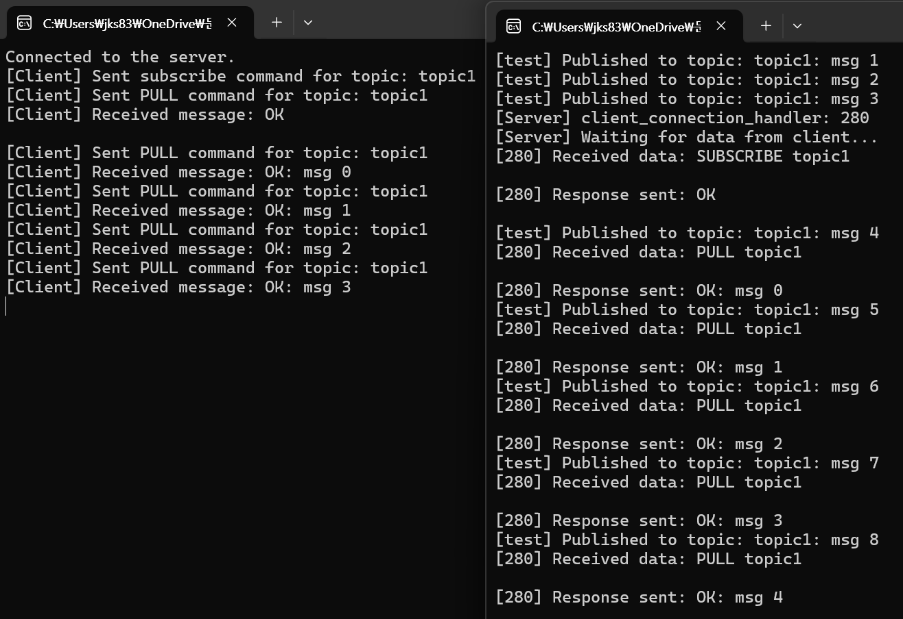

# message-broker
Windows C++ 기반 메시지 브로커 직접 구현

**※ POSIX OS에서는 동작하지 않는 Windows 기반 플랫폼용 메시지 브로커입니다.**

 

'데이터의 논리적 구분과 물리적 분산을 명확히 구분'한다는 **Apache Kafka의 설계 철학에 충실한 메시지 브로커 개발**을 목표로 한다.

메시지 브로커의 클라이언트는 C++부터 구현해보고 점차 Java, Python, Go로 확장할 계획

중앙에서 metadata를 관리하는 기술을 구현할 역량이 부족하다고 판단, 일단 Broker를 중앙 서버에서 관리하도록 하고자 함.

---

 

## 할일목록 (25.05.08 업데이트)

- [ ]  `read_next(cursor)` 스타일의 순차 메시지 소비, 커서(`segmentIndex`, `offset`) 기반 읽기 포인터 구조
- [ ]  소비자 offset 저장 및 복원
- [ ]  클라이언트에서 여러 Topic을 동시에 구독
- [ ]  성능 테스트 준비 - 병렬성, 처리량, 지연 시간, 스케일링 한계, 가용성, 리소스 사용량

 

## 주요 특징

### Network IO

- Non-Blocking IO : Windows 커널 오브젝트(IO Completion Port)를 이용한 proactor 비동기 작업
- Multi-Threading : 클라이언트의 요청을 쓰레드 단위로 병렬 처리
- Zero-Copy : 데이터를 복사하지 않고 직접 버퍼를 통해 처리해서 메모리 비용 절감
- Buffer Pooling : 데이터 전송시 효율적인 Buffer 관리

### Disk IO

- 로그 파일을 세그먼트로 나누고, 메시지의 오프셋 관리 및 멀티스레딩을 추가
    - 각 세그먼트의 메시지를 순차적으로 기록하고 읽는 방식
    - 멀티스레딩을 통해 동시에 여러 클라이언트가 메시지를 전송하고 처리
- Zero-Copy : 데이터를 Buffer에 직접 읽고 쓰는 방식으로 사용자 공간 ↔ 커널 공간 간의 복사 생략
- Sequentail I/O : Random Access I/O를 지양하도록 Disk에 연속적으로 기록

 

 

## Windows API - `mmap()`, `sendfile()`

Windows에서도 Kafka처럼 커널 수준의 IO API가 존재한다.

 

- socket 전송시 zero-copy해주는 TransmitFile (Linux의 sendfile)
    - `MapViewOfFile` : 유저 공간 버퍼 복사 생략
- 파일을 메모리에 mapping해서 유저모드 버퍼 → File IO없이 직접 조작 (Linux의 mmap)

- **파일 세그먼트 관리**: `baseFilename.0`, `baseFilename.1` 식으로 자동 로테이션
- **Flush 타이밍 명확화**: 매 세그먼트 종료 시 `FlushViewOfFile` 호출
    - flush는 OS 수준에서 묵시적으로 호출, `FlushViewOfFile()` syscall을 통한 강제 flush는 가능

 
